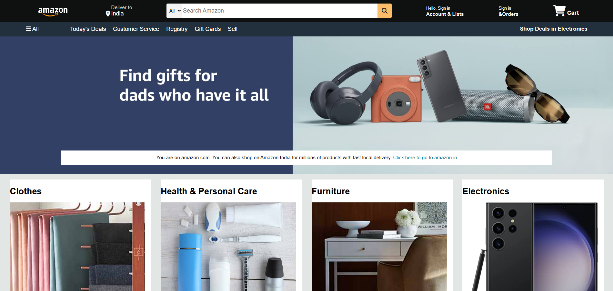

# Amazon UI Clone

A sleek, responsive frontend clone of the Amazon homepage built entirely from scratch. This project replicates the core layout and visual aesthetics of the world's most popular e-commerce platform.

## 🚀 Features

- **Responsive Navbar**: Includes the Amazon logo, location selector, search bar with category dropdown, and interactive cart icon.
- **Hero Banner**: Features a large promotional background image.
- **Product Grid**: A multi-column layout displaying different product categories with images and links.
- **Detailed Footer**: Replicates Amazon's extensive multi-column footer layout.

## 💻 Tech Stack

- **HTML5**: Semantic markup for the structure.
- **CSS3**: Vanilla CSS for styling, Flexbox/Grid for layout, and hover animations.
- **FontAwesome**: Used for crisp, scalable icons (cart, search, location).

## 🛠️ Dependency List

This is a pure frontend project built with vanilla HTML and CSS. There are **no backend dependencies** (like Python's `requirements.txt` or Node's `package.json`) required to run this project! You only need a web browser. 

## 🏃‍♂️ How to Run

Since this is a static site, running it is incredibly easy:

**Method 1: Direct File Open (Easiest)**
1. Navigate to the project folder.
2. Double-click the `index.html` file to open it in your default web browser.

**Method 2: Using Python's Local Server (Recommended for testing)**
If you have Python installed, open your terminal in the project folder and run:
```bash
python -m http.server 8000
```
Then, open your browser and go to: `http://localhost:8000`

## 📸 Screenshots


 

---
*Disclaimer: This is a clone created for educational purposes only. It is not affiliated with Amazon.*
